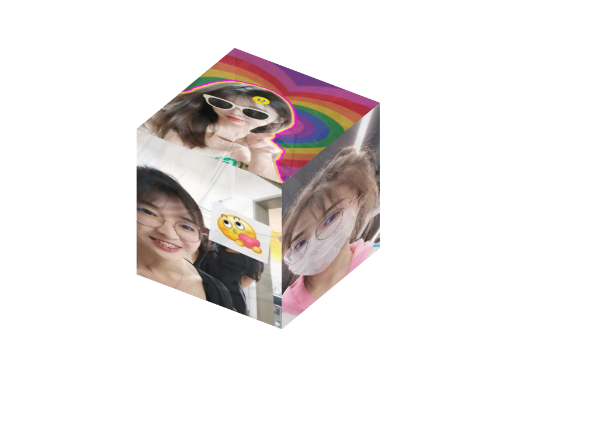

# gift_for_girl_friend

这是我在CSDN上找到的一个代码，然后换了个图片，加了几句自己写给女朋友的小诗句，还是蛮简单的。
然后只要在Settings中的Page中部署，就可以让女朋友用链接访问你为她准备的小礼物啦
效果展示.mp4是我代码部署好之后页面的样子

只需自己把img里面的6张图片换成自己的，在index.html中图片链接的地方适当修改成自己的图片对应的名称就能使用了。

自己下面这是我参考的CSDN文章的链接
https://blog.csdn.net/SmartJunTao/article/details/126136613
